>Son el conjunto de sistemas, herramientas y dispositivos que usamos generalmente para procesar, almacenar, transmitir, recuperar información.

>## Agunos ejemplos más comunes son:
>
>>### Hardware (Partes Físicas)
>>
>>Como Computadoras y teléfonos inteligentes.
>
>>### Software (Elementos Lógicos)
>>
>>También conocido como Programas o Aplicaciones.
>
>>### Redes
>>
>>Es por donde se transportan los datos, como los archivos que enviamos o recibimos.
>
>>### Bases de Datos
>>
>>Es el espacio dedicado a guardar información.

